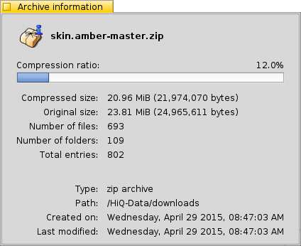

===================
Archive Information
===================

The Archive Info window displays information relevant to the archive.
The information includes the compression ratio of the archive, the
type of archive and other information which maybe useful.

Below is a screenshot of the Archive Info window for a zip archive.

**Compression Ratio:** Denotes how compressed the archive is compared
to its uncompressed size. The higher the percentage, the more
compressed the archive

**Compressed Size:** The current storage size of the archive

**Original Size:** The estimated size of files when the archive is
uncompressed. (note: size of file attributes aren't included)

**Number of files:** The total number of files present in the archive

**Number of folders:** The total number of directories in the archive

**Total entries:** The total number of entries (directories + files)

**Type:** The type of archive as detected by Beezer

**Path:** The location of the archive

**Created On:** The date and time when the archive was created (as
reported by filesystem)

**Last Modified:** The date and time when the archive was last
modified (as reported by filesystem)
