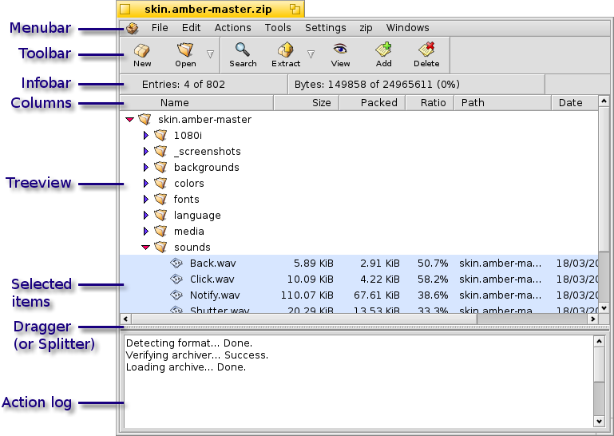
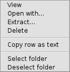

==============
Archive Window
==============

.. contents:: Archive Window Components
   :depth: 3
   :local:
   :backlinks: none

Beezer reserves an archive window for every archive you open. The
archive window is written in such a way that it always remains as
responsive as possible rather than locking up during long operations.

TreeView
========

   Archive contents are displayed in a directory-tree structure. Such a
   tree structures improves readability as compared to a plain list of
   files (like in *WinZip*). It also makes working with entire folders
   effortless. For instance, you can select a folder and perform
   operations on the folder rather than selecting each file inside the
   folder.

Columns
-------

      Columns in the treeview are flexible. You can resize them by clicking
      and dragging the left or right borders of the column. You can
      re-arrange the order of the columns by dragging the column's title
      area. During the course of moving a column you can see a blue-outline
      of the column you are dragging. You can also hide columns from the
      menu: Settings –> Columns.

      You can sort columns, by clicking on them. Columns that are sorted are
      underlined. You can sort multiple columns by holding **SHIFT** and
      clicking more columns. Sorting can be ascending, descending or unsorted
      (no underline). You can cycle through these by simply clicking the
      column. For example, if a column is sorted in ascending order, clicking
      it will sort it in descending order. Another click will leave it
      unsorted, the next click will sort it in ascending order again, and so
      on.

      You can double-click the edge of a column to automatically resize the
      column to fit all its content, similar to double-clicking a column edge
      in a *Tracker* window.

Folders & Files
---------------

      Folders in an archive can be collapsed (folded) and expanded
      (unfolded). You can do this is several different ways. You can use the
      **LEFT** arrow-key to collapse a selected folder and use the **RIGHT**
      key to expand (unfold) a folder. This is a very handy method of doing
      it as its close to the other arrow-keys which you use to navigate the
      archive.

      You can also fold/unfold folders by clicking the arrow-icon located
      before the folder name. The **ENTER** key on a selected folder also
      folds/unfolds it.

      You can select an entry (file or folder) by clicking on it. You can
      select multiple entries by using **ALT** or **CTRL** keys (depending on
      your keyboard settings). You can select a range of entries by using the
      **SHIFT** key. Also you can keep extending the selection using **SHIFT**
      with **DOWN** or **UP** arrow-keys. Double-clicking an expanded
      (unfolded) folder selects all the files and sub-folders in it. This can
      be handy as well.

      Please bear in mind that items that are hidden (in collapsed folders)
      are not selected. But some operations select the file if you select its
      parent folder. For example, when you delete a folder that is collapsed
      (folded), the files inside it are selected and deleted as well.

Context menu
------------

      When you right-click on the treeview, you can see a quick Context menu
      appear. This comes in handy as you are not required to "reach" for the
      main menus each time you want to do an frequent action. The context
      menu can be invoked either on a selection, or when no selection is
      present invoking the context menu will make a selection before
      invoking the menu.

      The Select Folder command select all the contents of all selected
      folders. It's sometimes handy to right-click a folder and choose this.

LogView
=======

   The logview (also called Action Log) is a textual information area that
   updates you with relevant information regarding a process and its
   result. It's like a status bar with a history. The logview may also come
   in handy when you want to see whether or not you have performed an
   action before. It's a simple log that is not saved to the harddisk.
   Hence, once you close the archive the logview's information is lost.

   Right-clicking the logview invokes a menu that allows you to retain its
   contents or clear the logview's data.

   The logview can be hidden using Settings –> Action Log command. You can
   resize the logview by clicking and dragging the dotted-space between the
   logview and the Treeview. This space is referred to as "dragger". You
   can change the logview's position (orientation) by right-clicking the
   dragger - i.e. from vertical to a horizontal position and vice versa.

Toolbar
=======

   The toolbar is a set of buttons that contains the most frequently used
   commands for easy access. The toolbar can be hidden by right-clicking
   space not occupied by a toolbar button (an empty space) or the space at
   the far end of the toolbar. You can also hide the toolbar from Settings
   –> Toolbar. Each of the toolbar buttons are described.

   .. image:: images/Toolbar_New.png
      :alt: Toolbar New

   Allows you to :doc:`create <CreatingArchives>` a new archive.

   .. image:: images/Toolbar_Open.png
      :alt: Toolbar Open

   Allows you to open an existing archive. Clicking on the context portion,
   invokes a popup menu allowing you to open a recently opened archive.

   .. image:: images/Toolbar_Close.png
      :alt: Toolbar Close

   Closes the archive. If it's the last archive to be closed either the
   :doc:`Welcome window <WelcomeWindow>` will be shown or Beezer will
   quit - depending on the settings in
   :ref:`Preferences <Preferences:Miscellaneous>`.

--------------

   .. image:: images/Toolbar_Search.png
      :alt: Toolbar Search

   Brings up the :doc:`Search window <SearchingArchives>` from where you
   can search the :ref:`ArchiveWindow:TreeView`.

   .. image:: images/Toolbar_Extract.png
      :alt: Toolbar Extract

   Extracts the archive to default extract location (if any). Click
   :doc:`here <ExtractingFiles>` for more info.

   .. image:: images/Toolbar_View.png
      :alt: Toolbar View

   Opens the selected file using the application that is associated with
   the file. Click :doc:`here <ViewingFiles>` for more info.

   .. image:: images/Toolbar_Add.png
      :alt: Toolbar Add

   Allows you to add files and folders to an archive. This button may be
   disabled for certain types of archives. Click
   :doc:`here <AddingFiles>` for more info.

   .. image:: images/Toolbar_Delete.png
      :alt: Toolbar Delete

   Allows you to delete the selected entries from an archive. Click
   :doc:`here <DeletingFiles>` for more info.

 

Infobar
=======

   The Infobar displays information regarding the selected entries (files &
   folders). You can show/hide the Infobar by right-clicking on it. You can
   also show/hide it from Settings –> Infobar.

   .. image:: images/Infobar.png
      :alt: Infobar
      :align: center

   The first 'slot' in the Infobar, displays the number of selected entries
   as against the total entries in the archive. For example, "6/229"
   indicates that 6 entries are selected from a total of 229 entries in the
   archive.

   The next portion of the Infobar, displays the total size of the selected
   entries as against the total size of the archive (in bytes). It also
   shows how much percent of the archive size is selected.

   The thing to remember is that, the display does NOT go deep into
   folders. As you must be aware by now, selecting a collapsed (folded)
   folder in the archive does NOT select the entries inside the selected
   folder. The Infobar thus shows only what is selected.

Menubar
=======

   The menubars are like in any other Haiku application. The menus are
   explained below

   .. image:: images/Menubar.png
      :alt: Menubar
      :align: center

< System >
----------

      -  Help: Opens this manual
      -  About Beezer: Displays developer information, copyright and credits
      -  Quit: Closes all open windows & quits Beezer

File
----

      -  New: Allows you to create new archives. See
         :doc:`Creating archives <CreatingArchives>` for more info
      -  Open: Open an existing archive (sub-menu contains recent archives)
      -  Close: Close the current window
      -  Delete: Allows you to delete the archive. See
         :doc:`Deleting archives <DeletingArchives>` for more info
      -  Archive Info: Shows archive info. See
         :doc:`Archive info <ArchiveInfo>` for more info
      -  Password: If the archive type supports a password, this is where you
         set it

Edit
----

      -  Copy: Either copy the selected archive entries or selected log-view
         text to the clipboard
      -  Select All: Selects all visible entries in the archive, sub-menu does
         as it says :)
      -  Deselect All: Deselects any selected entry from the treeview
      -  Invert Selection: Selects what is not selected and vice versa in one
         operation
      -  Expand All: Unfolds (expands) all folder entries
      -  Expand Selected: Unfolds (expands) all the folder entries in the
         selection
      -  Collapse All: Folds (collapses) all folder entries
      -  Collapse Selected: Folds (collapses) all the folder entries in the
         selection
      -  Preferences: Opens up Beezer's preferences

Actions
-------

..
   TODO add direct section links
..

      -  Extract: See :doc:`ExtractingFiles` for more info
      -  Extract To: See :doc:`ExtractingFiles` for more info
      -  Extract Selected: See :doc:`ExtractingFiles` for more info
      -  View File: See :doc:`ViewingFiles` for more info
      -  Open With: See :doc:`ViewingFiles` for more info
      -  Test: See :doc:`TestingArchives` for more info
      -  Search Archive: See :doc:`SearchingArchives` for more info
      -  Comment: See :doc:`EditingComments` for more info
      -  Delete: See :doc:`DeletingFiles` for more info
      -  Create Folder:See :doc:`CreatingFolders` for more info
      -  Add: See :doc:`AddingFiles` for more info

Tools
-----

      -  File Splitter: See :doc:`tools/FileSplitter` for more info
      -  File Joiner: See :doc:`tools/FileJoiner` for more info

Settings
--------

      -  Save as Defaults: Saves the current interface settings as the default
         settings, so that next time an archive (without interface settings)
         is opened, these settings would be used
      -  Save to Archive: Saves the current interface settings to the archive.
         The next time the archive is opened (and if permitted by Preferences)
         the settings will be restored. Please note that these settings tend
         to increase the size of the archive by a few bytes. Also they work
         only on BFS volumes as attributes are used.
      -  Toolbar: Hide/Show the toolbar
      -  Infobar: Hide/Show the infobar
      -  Action Log: Hide/Show the action log
      -  Columns: Hide/Show columns in the treeview
      -  While Opening: Allows you to set the level of folded (collapsed)
         folders while loading the archive. The more folded, the faster the
         archive loads but for working with archives you may need to expand
         them once loading is done. Generally if you only extract archives,
         you can keep the folding level to 1 or all folded.

< archiver >
------------

      The archiver menu is a dynamically created menu. It contains the
      settings used by the archive format. For example, zip add-on creates a
      "zip" settings menu having options specific to the zip format. Thus,
      the archiver menu varies in it's options for each archive format. Some
      archive formats may not even have such a menu.

      -  Save as Defaults: Saves the current archiver settings as defaults.
         The next time an archive of this type is opened, these settings would
         be used
      -  Save to Archive: Saves the current archiver settings to the archive.
         The next time the archive is opened (and if permitted by Preferences)
         the settings will be restored. Please note that these settings tend
         to increase the size of the archive by a few KiB. Also they work only
         on BFS volumes as attributes are used.

      For other options, refer the "Miscellaneous Info" sections for help on
      the appropriate add-on's options.

Windows
-------

     Gives you a list of archives that are currently open. The first 10
     archives have shortcut keys. Such as **COMMAND** + **N**, where "n" is
     from 0 to 9. You can quickly switch between archives using these
     shortcuts. Selecting one of them activates it. The currently active
     window is indicated by a mark.
