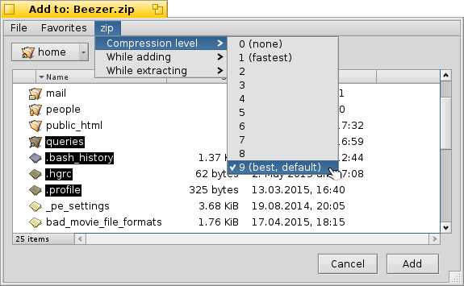

=================
Creating Archives
=================

When you choose to create a new archive, a file requester prompts you
to enter the location (path) and name of the archive. You can also
select the type of archive to create from the nearby pop-up menu.
Once you have enter the name of the archive and selected the type of
archive, click the "Create" button.

*Do NOT choose the files you wish to add in this file requester*.
This file requester is only for choosing the name, type and location
of the archive you wish to create and NOT what files should be in the
archive. The following file requester is for that.

Next, you will see another file requester that prompts you to add the
files & folders you wish to add to the archive. Here, depending on
the type of archive you have selected, the archiver's settings menu
can be found in the menubar. Look at the picture below, that shows
the settings menu being accessed.

The advantage of accessing the menu here is that you get to adjust
the options BEFORE creating the archive. Say, for example, you are
zipping mp3s (to transfer them with their attributes to another Haiku
system via FTP), you might want to set the compression level to zero
(no compression just store) as it makes things much faster and the
size-tradeoff is less. Thus you can do so right here by choosing the
compression level.

Also, if the archive supports password protection for files, you will
see a textbox on the left-bottom of the add panel (not shown on the
above illustration) which allows you to supply the password to use to
encrypt the files in the archive. You can leave/set this password
field to blank to specify no password protection for the files you
are about to add.

Once you have chosen the files you wish to add, click the "Add"
button. Then a new archive will be created and the files you chose
will be added to it. Click :doc:`here <AddingFiles>` for info on
the add process.
