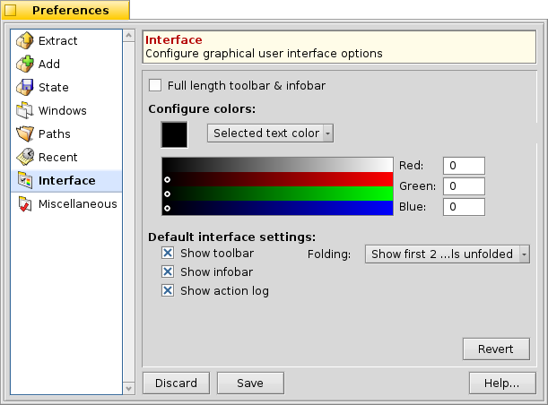

==================
Preferences Window
==================

.. contents:: Preferences Window Components
   :depth: 3
   :local:
   :backlinks: none

To edit the application Preferences, choose either Edit –>
Preferences or from the :doc:`WelcomeWindow`'s Prefs
toolbar button. You'll see a window that resembles the one below...

While you have the Preferences window open all other windows in
Beezer would be inaccessible.

Overview
========

   The Preference window classifies various options into "Panels", such
   as "Extract", "Add" etc. Extract panel would have options related to
   extracting of archives, Add with adding of files to the archive and
   so on.

   Each panel has "Revert" button which when clicked undoes any change
   you made since you opened THAT preference panel.

   The "Save" button located at the bottom of the Preference window,
   saves and applies the currently shown preferences, while "Discard"
   cancels any changes you made since you opened the window.

Restoring the default options
=============================

   Beezer doesn't provide any internal method to restore the default
   options for a panel, but you can easily restore the default of any
   preference panel simply by deleting that panel's settings file. Every
   panel saves its settings in a seperate file. Deleting that file will
   make Beezer use the default options for that panel. For example, the add
   panel will have be saved in ~/settings/Beezer/add_settings, extract
   panel in ~/settings/Beezer/extract_settings.

Preference Panel Details
========================

   The menubars are like in any other Haiku application. The menus are
   explained below

Extract
-------

   The extract panel gives you options related to extracting of archives.
   Note, this extraction includes not just extracting the entire archive
   but also extracting selected files and drag 'n drop extraction as
   well.

      -  Open destination folder after extraction: After extraction of files
         is complete the folder in which you have extracted will automatically
         by opened
      -  Close window after extraction: Closes the :doc:`archive window <ArchiveWindow>`
         after extraction is complete (note:
         this may lead to quitting of Beezer depending on "When last archive
         is closed" option in :ref:`Preferences:Miscellaneous` panel)
      -  Quit Beezer after extraction: Quits entire Beezer after extraction of
         an archive is complete

Add
---

   Here you get to configure options related to adding entries to the
   archive

      -  Replace files: Specifies what action has to be taken when a file(s)
         you are adding already exists in the archive. The options are

         -  **Never replace**: will never overwrite the file in the archive
         -  **Ask me before replacing**: asks you before replacing any file,
            this is the default action
         -  **Without asking**: always replaces files without asking you
         -  **When new file is more recent**: Replaces the file in the archive
            with the file being added if the new file has a more recent
            modification date

      -  Confirm when adding more than "n" MiB: Whether confirmation is asked
         when you add more than "n" MiB. The default is 80 MiB
      -  Confirm when adding through drag 'n drop: Whether confirmation is
         asked when you drag 'n drop files to the archive
      -  Sort after add (n/a for reloading types): Whether the treeview must
         be sorted after each add operation. For very large archives you may
         not want to sort after every add operation as it can take time on a
         slow machine. However, for archive types that reload the entire
         archive after an add operation this option wouldn't be applicable

State
-----

   The state panel allows you to configure state information. State info
   is info that is 'tagged' along with archives using Haiku file
   attributes. Because of this, state info would be lost if the archive
   is moved to a filesystem that doesn't support Haiku attributes (such
   as vfat, ntfs, ext3 etc.).

   Please be aware that storing **Archiver settings** to the archive can
   increase the archive's size by several KiB. **Interface state** only
   occupies about 413 bytes.

   Also you can manually **remove state info** from an archive by opening
   the archive through *QuickRes* utility and deleting the fields named
   "bzr:ui" and "bzr:ark".

   You can manually save state info into archives of your choice rather
   than using these automatic options for every archive. For this use
   Settings –> Save to Archive and (archiver menu) –> Save to Archive
   options from the :ref:`main menu <ArchiveWindow:Menubar>`.

      -  Store Automatically: The options under this section determine what
         state information to automatically store in archives. **Interface
         state** saves interface settings such as the size, position, columns,
         sorting, folding level etc. of the :doc:`archive window <ArchiveWindow>`.
         **Archiver settings** saves the
         archiver's settings menu in the archive. By default automatic storing
         of state info is OFF.
      -  Restore Automatically: This automatically restores the respective
         states from the archive when its loaded, by default restoring of
         state info is ON.

Windows
-------

   This panel allows you to configure which windows store their size,
   position etc.

Paths
-----

   The paths panel allows you to specify various default locations
   (paths) etc.

      -  Open Path: Specifies the default directory that will be shown in the
         "Open archive" file requester. For example, if you have most of your
         archives in one folder, say "/boot/home/Downloads/", you can specify
         that path here so that you can quickly open archives without
         'navigating' to that folder
      -  Add Path: Specifies the default directory that will be shown in the
         "Add files to archive" file requester
      -  Extract Path: Specifies the default extract path. The options for
         this are:

         -  **Same directory as source (archive) file**: Means the folder in
            which the archive exists will be used as the default extract path
         -  **Use**: Allows you to choose anyother default extract location.
            If you chosen this option and leave/make this empty, then you have
            not specified any default extract location, as a result Beezer
            prompts you for the destination folder each time

      -  Favourite extract paths: Here you can add (using "+" button) any
         number of favourite extract locations (paths). These locations show
         up in the extract sub-menus so you can quickly extract to any of your
         favourite locations. You can remove a favourite path by selecting it
         and clicking the "-" button
      -  List more paths (using archive name): When this option is turned on
         (which it is by default), for each favourite path, the name of the
         archive added and a new path is generated and shown in the extract
         sub-menus.
         For example, if you have "/boot/Programs" as one favourite path, and
         you open the archive "MyFiles.zip", having this option on, will
         produce another favourite path "/boot/Programs/MyFiles" apart from
         "/boot/Programs". This can be useful when you open archives that
         don't have a root folder

Recent
------

   The recent panel allows you to configure settings related to recent
   archives, paths.

      -  Number of recent archives: Allows you to specify how many recent
         archives to list in the recent archives menu (10 recent archives are
         listed by default)
      -  Show full path in recent archives: If this option is turned on, the
         full path of the archive would be displayed, otherwise only the name
         of the archive would be displayed. (by default full paths are turned
         OFF)
      -  Number of recent extract paths: Allows you to specify how many recent
         extract paths to list (by default 5 recent extract paths are listed)

Interface
---------

   The interface panel allows you to configure settings related to
   Beezer's GUI

      -  Full length toolbar & infobar: Allows you to choose if you want the
         Toolbar and the Infobar to have a full window width look.
      -  Configure colors: Allows you to configure a few colors used in the
         interface - you can get back default interface settings by deleting
         the corresponding settings file

         -  **Selected text color**: The foreground color of selected
            files/folders
         -  **Selected background color**: The selection color

      -  Default interface settings: Allows you to modify the default archive
         window settings. These default settings will be used for newly
         created archives and for archives that do not have interface settings
         stored with them, and if you have turned OFF the "Restore State"
         option for all archives!

         -  Show toolbar: Toggle toolbar visibility
         -  Show infobar: Toggle infobar visibility
         -  Show action log: Toggle the action log's visibility
         -  Folding: Allows you to choose the depth of collapsed items. This
            can sometimes prove very useful.
            For most of the time you can safely use the "Show all levels
            unfolded" option, meaning the entire archive tree (all directories
            and sub-directories). But for some very very huge archives, using
            the other settings may save enormous amount of loading time!
            Consider the case when all you want to do is open "Huge.zip"
            (having 20,000+ files) and extract it. Normally using the "Show
            all levels unfolded" option and loading the huge archive can take
            several minutes. But now, you should use the "Show all items
            folded" option and *then* open the archive. Chances are it will
            load in an instant, possibly even upto 30 times faster! And now...
            you are free to start the extract process in few seconds rather
            than wait for minutes for Beezer to load, add and draw all the
            items in the archive.

Miscellaneous
-------------

   Various miscellaneous options

      -  When last archive is closed: Allows you to choose what action to take
         when Beezer starts up

         -  **Show welcome window**: Shows the :doc:`welcome window <WelcomeWindow>`
            when starting up - this is the default action
         -  **Show create archive panel**: Shows the panel for :doc:`creating archives <CreatingArchives>`
            , choosing "Cancel" will quit Beezer
         -  **Show open archive panel**: Shows the panel for opening an
            existing archive, choosing "Cancel" will quit Beezer

      -  When last archive is closed: Specify what action should be taken when
         the last archive window is closed

         -  **Show welcome window**: reopens the :doc:`welcome window <WelcomeWindow>`
         -  **Quit Beezer**: quits Beezer completely

      -  Show comments (if any) after opening the archive: Self-explanatory
         (by default it's on)
      -  Check file types at startup: Each time Beezer starts, checks if
         Beezer is the preferred application for its supported archive types,
         by default it is off
      -  Register file types now: This registers Beezer as the preferred
         application for its supported archive types. Once you do this, you
         can turn off the "Check file types at startup" option
      -  Default archiver: Choose the default archiver while creating archives
