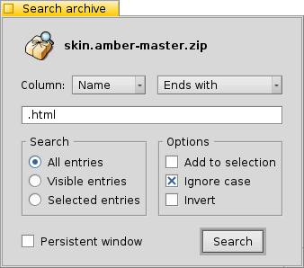

======================
Searching Archives
======================

Beezer allows you to search for files and folders in an archive.
Please note, this search does NOT search the actual contents of each
file in the archive. Rather it searches the names of files/folders.

Once you have chosen to search the archive, the Search window pops
up. It resembles something like the one shown below:

Column
======

   The column pop-up lets you choose which column to search in. The
   columns that are listed here depend on the type of archive you have
   opened. Some archive types do not have information about all columns.
   For example, the tar archiver does not list information about the
   "CRC" of files or the "Packed" size of files (as tar doesn't support
   compression only storage). Thus only the columns that have searchable
   content are listed.

   The pop-up menu beside the Column pop-up menu is a list of the
   methods of searching. They include "Starts with", "Ends with",
   "Contains", "Matches wildcard expression" and "Matches regular
   expression". These are self-explanatory search methods.

Search text field
=================

   Enter the string (text) you are searching for. In the above example, we
   are searching for all files that end with ".html".

Search
======

   Define the scope of the search here.

      -  **All Entries**: This means all the entries in the archive will be
         searched. Before the search begins, all the folded (collapsed) folders
         will be expanded, then the search will commence

      -  **Visible Entries**: This option specifies only physically visible
         entries be searched. Thus if a folder is collapsed, files and folders
         inside the collapsed folder will not be searched

      -  **Selected Entries**: This option specifies that only the entries that
         have been selected must be searched

Options
=======

   Choose one or more options that you can apply to your search.

      -  **Add to selection**: This means any newly found entries are added to
         the existing selection. If this option is not checked, a search always
         deselects ALL entries before searching

      -  **Ignore case**: Uppercase and lowercase alphabets are treated the same,
         e.g. a search for "ReadMe" and "readme" yield similar results

      -  **Invert**: Reverses the result of the search, i.e. all entries that DO
         NOT match the search are selected and vice versa

Persistent window
=================

   Checking this option prevents the search window from closing after a
   search. This can be very useful when you want to do several searches
   that accumulate results. Like say, searching for ".htm", ".html", ".txt"
   etc.

Once you have chosen the options, click the "Search" button. The results
are shown in the :doc:`Archive window <ArchiveWindow>` itself in the
form of selections. You can easily find if a search has failed or not by
looking at the :ref:`Infobar <ArchiveWindow:Infobar>`.
