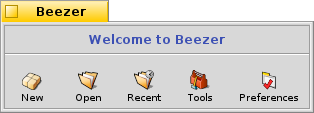

==============
Welcome Window
==============

When you fire-up Beezer you will see the Welcome window. This window
looks like the one shown below:

The four buttons' functions are listed below:

   -  New: Lets you :doc:`create <CreatingArchives>` a new archive
   -  Open: Lets you :doc:`open <ArchiveWindow>` an existing archive
   -  Recent: Allows you to choose one of the most recently used
      archives
   -  Tools: Gives you a list of available tools for Beezer
   -  Preferences: Opens up the :doc:`Preferences`
      window from where you can configure Beezer's settings

Drag 'n Drop
============

   Apart from the above functions, the Welcome window also provides an
   easy way to open archives. You can drop any archive (or set of
   archives) from *Tracker* and Beezer will try and open them for you.
