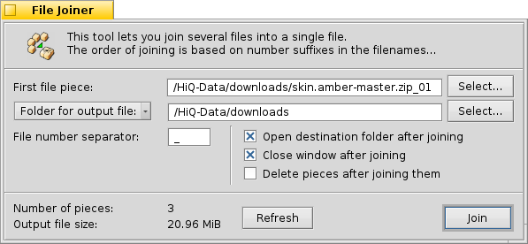

===========
File Joiner
===========

The File Joiner is used to re-join the pieces of files created by the
File Splitter tool. Though there is an option of using the
:ref:`self-joining executable <FileSplitter:SelfJoin>` the Joiner
tool offers more options.

The File Joiner can be opened from two places within Beezer, one from
the :doc:`Welcome window <../WelcomeWindow>` and the other from the
:doc:`Archive window <../ArchiveWindow>`.

**First file piece**

   Allows you to specify the first piece in the list of pieces that are
   to be joined. Clicking the "Select" button lets your browse your
   computer and choose a file that is the first piece of a series of
   pieces that need to be joined. You can alternatively, directly type
   in the path of the first piece file in the textbox.

**Folder for output file**

   When clicked gives a list of recently chosen directories. Clicking the
   "Select" button lets you browse your computer and choose a directory.
   You can alternatively, directly type in the path of the folder in the
   textbox. This directory is where Beezer will create the joined file.

**File number separator**

   The file number separator separates the file name from the split order
   number. Click :ref:`here <FileSplitter:FileNumberSeparator>` for more
   information.

**Open destination folder after joining**

   If this option is checked, after joining of the files is complete, the
   folder in which the joined file was created is automatically opened

**Close window after joining**

   Closes the File Joiner tool after joining is complete. If the join
   operation is cancelled, the window isn't closed even if this option is
   specified.

**Delete pieces after joining**

   If this option is checked, the piece/chunk files are automatically
   deleted after they are joined. The pieces will not be deleted if the
   operation is cancelled before it's complete.

**Number of pieces**

   Shows you how many pieces are there to be joined. When using custom
   number separators, this is a good indication that you have specified it
   correctly.

**Output file size**

   Shows you the estimated size of the joined file before creating it.

**Refresh**

   Click this will update the above two controls.

**Join!**

   This will start the process of joining the files.

**! Tip**

   You can drop the first piece file to the File Joiner window. Also, you
   can drop a folder on the File Joiner window to specify the folder for
   creating the joined file.
