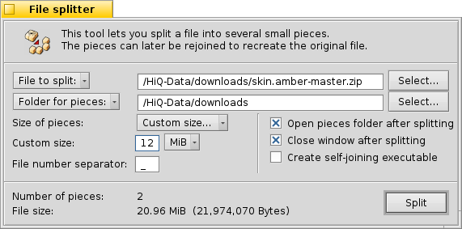

=============
File Splitter
=============

Beezer 0.07 onwards comes with tools to split and join files. As you
may know :) the File Splitter is used for creating small pieces of a
larger file. The File Splitter will not actually break a file into
smaller pieces but rather make small pieces from a file, meaning the
original file is not altered, only the pieces are created.

The File Splitter can be opened from two places, either from the
:doc:`Welcome window <../WelcomeWindow>` or from the :doc:`Archive window <../ArchiveWindow>`.

**File to split**

   When clicked gives a list of recently split files that you can choose
   from. Clicking the "Select" button lets your browse your computer and
   choose a file. You can alternatively, directly type in the path of
   the file in the textbox.

**Folder for pieces**

   When clicked gives a list of recently chosen directories. Clicking the
   "Select" button lets you browse your computer and choose a directory.
   You can alternatively, directly type in the path of the folder in the
   textbox. This directory is where Beezer will put the split file pieces.

**Size of pieces**

   Allows you to specify what is the size of each piece/chunk. You can
   either choose from a list of pre-defined sizes such as "1.44 MB -
   (floppy)", "650 MB - (CD)" and so on, or choose "Custom Size" and
   specify your own size. Please note the minimum size of a piece is 1
   byte, and the maximum size being 1 bytes less than the size of the file
   being split.

.. _FileSplitter:FileNumberSeparator:

**File number separator**

   By default, File Splitter when splitting a file called MySong.mp3 into 2
   pieces, it would create the pieces named, MySong.mp3_01. and
   MySong.mp3_02. The underscore ("_") here is called the file number
   separator. The file number separator thus separates the file name from
   the split order number.

   You can thus specify anything in place of the underscore as the file
   number separator, for example using ".z" for compatibility with
   *WinZip*'s spanning method and so on.

   Currently, digits (0-9), wildcards (\* and ?) and path characters (: and
   /) are not allowed. Other than that you can enter anything.

**Open pieces folder after splitting**

   If this option is checked, after splitting of the file is complete, the
   folder in which the pieces were created is automatically opened.

**Close window after splitting**

   Closes the File Splitter tool after splitting is complete. If the split
   operation is cancelled, the window isn't closed even if this option is
   specified.

.. _FileSplitter:SelfJoin:

**Create self-joining executable**

   If this option is checked, Beezer will create a Haiku executable file in
   the pieces folder, that when run will automatically re-join the pieces
   to create the original file.

   This executable is a Haiku executable and cannot be run from Windows.
   Also this executable can be run from a system that does not have Beezer
   installed. It is completely independent of Beezer and would be useful if
   you are sending the split files to someone who has Haiku or other
   flavours of it and whom does not have Beezer. It is also very useful for
   quickly re-joining the files and is faster than opening Beezer, and
   using the :doc:`File Joiner <FileJoiner>` tool.

   **Note:**

      For the self-joining executable to work it must be placed in the SAME
      directory as the pieces and the pieces should NOT be renamed, as the
      executable contains information about the pieces and it's file number
      separators.

   **Number of pieces**

      Shows you how many pieces will Beezer end-up creating for the specified
      size of pieces and the file size. Note, Beezer cannot create any more
      than 32767 pieces.

   **File size**

      Shows you the size of the file that is to be split.

   **Split!**

      Clicking this would start the split process. This process can safely be
      cancelled before it completes. Beezer will delete any partially created
      pieces, but whatever pieces are fully created will not be deleted.

   **! Tip**

      You can choose files to split from the *Tracker* by dropping them on the
      File Splitter window. Also, you can drop a folder on the File Splitter
      window to specify the folder for creating the pieces.
