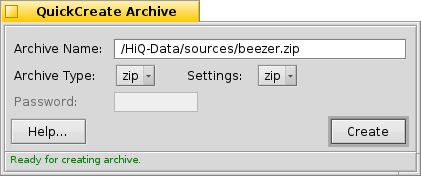

===================================
QuickCreate Archive (Tracker AddOn)
===================================

The QuickCreate Archive is a *Tracker* add-on that lets you create
archives with minimal clicks :) The basic idea was to do a
replacement for *Zip-O-Matic* but instead of just supporting zip
format alone, QuickCreate would allow control over the format, and
all the options that are supported in Beezer.

The QuickCreate Archive is actually a sort of hack. It resides within
Beezer but is invoked using a *Tracker* add-on. You cannot launch
QuickCreate explicitly from Beezer as it isn't listed under "Tools".
This is not what it is meant for and hence isn't listed there.

How to Use
==========

   Using QuickCreate is very similar to using *Zip-O-Matic*. Here's a
   quick run-through in anycase...

   .. image:: ../images/AddOnInvoke.png
      :alt: Beezer AddOn Invoke
      :align: center

   #. In *Tracker*, select the files you want to archive.
   #. Right-click and choose Add-Ons –> Beezer as shown in the picture
      above
   #. Now you are all ready to archive the files you have chosen, and
      the QuickCreate window will be shown as shown in the picture below

**Archive Name**

   This shows the path and name of the Archive that will is to be created.
   You can chop and change elements of the path (such as modifying
   destination directories, and file name).

**Archive Type**

   Allows you to choose what format archives you are going to make. Please
   note, as always, the necessary binaries needs to be installed in your
   system and the "workers" folder must have valid (non-broken) links to
   the binaries.

**Settings**

   For the chosen archive type, this is the list of available settings.
   Usually, you needn't keep changing these but in cases where you need to
   alter the options before creating the archive (such as modifying
   compression level, modifying storage of attributes etc.) you need to use
   this.

**Password**

   For those archive types that supports passwords (and supported by
   Beezer) you can input passwords. Currently, zip passwords are not
   supported due to the nature of the zip binary. But in anycase for real
   security purposes you should use a full-fledged encryption tool such as
   Cryptic for BeOS.

**The status line**

   The status line at the very bottom of the QuickCreate window shows you
   some information to assist you in creating archives. For example, if the
   archive name chosen already exists, the status line shows a warning text
   reminding you the existing file will be overwritten and so on.

Once you are all set to create an archive just press **ENTER** or hit
the "Create" button!! Cancelling the operation is allowed, but doing so
will almost always delete the incomplete archive rather than get an
archive with partially added files....

**! Tip**

   You can specify the default archive type to make the quick create
   process even faster! That can be done from
   :ref:`Preferences: Miscellaneous <Preferences:Miscellaneous>`.
